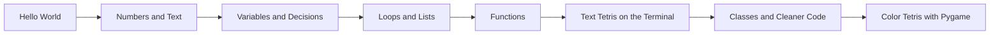

# Easy Python — Programming for Absolute Beginners

Welcome! This tutorial teaches **Python programming** from zero — no math degree, no computer science background required. You only need curiosity and patience.

By the end, you will understand variables, conditions, loops, functions, lists, and classes — and you will have built your own **Tetris** game, step by step.

## Who This Is For

- Students who have **never programmed**
- Professionals switching careers
- Anyone who finds technical books too fast or too jargon-heavy

We explain every idea in **plain language**, with pictures, analogies, and small exercises before each big step.

## What You Will Build

**Tetris** is perfect for learning:

- A **grid** teaches lists and 2D data
- **Moving blocks** teaches variables and updates
- **“Can it fit here?”** teaches `if` statements
- **Repeating until game over** teaches `while` loops
- **Drawing and scoring** teaches functions
- **Pieces as objects** teaches classes

## Tutorial Parts

| Part | Chapters | What you learn |
|------|----------|----------------|
| **1. Welcome** | 3 | What programming is, why Python, our Tetris plan |
| **2. Setup** | 4 | Install Python, editor, run code, virtual environments |
| **3. Basics** | 4 | Output, numbers, text, user input |
| **4. Variables** | 3 | Names, assignment, reusing values |
| **5. Decisions** | 3 | True/false, `if` / `else`, combining conditions |
| **6. Loops** | 3 | `while`, `for`, common patterns |
| **7. Collections** | 3 | Lists, 2D grids, dictionaries |
| **8. Functions** | 3 | Reusable blocks of code |
| **9. Tetris — Foundations** | 4 | Board, shapes, drawing, project structure |
| **10. Tetris — Game Logic** | 5 | Move, collide, lock, clear lines, score |
| **11. Classes** | 3 | Objects, `Piece` class, refactor Tetris |
| **12. Finale** | 3 | Pygame graphics, polish, where to go next |

**Total: 40 chapters** — work through them in order.

## How to Use This Tutorial

1. **Read** one chapter at a time — do not skip the setup chapters.
2. **Type** every example yourself (do not copy-paste only). Typing builds memory.
3. **Run** the program after each change. See what happens.
4. **Do** the “Try it yourself” boxes at the end of chapters.
5. **Save** your Tetris files in one folder (we suggest `my_tetris/`).

## Chapter List

### Part 1 — Welcome

1. [Welcome to Programming](part1-welcome/01-welcome-to-programming.html)
2. [What Is Python?](part1-welcome/02-what-is-python.html)
3. [Your Tetris Learning Journey](part1-welcome/03-your-tetris-journey.html)

### Part 2 — Setup

4. [Install Python](part2-setup/01-install-python.html)
5. [Editor and Development Tools](part2-setup/02-editor-and-tools.html)
6. [Your First Program](part2-setup/03-first-program.html)
7. [Virtual Environments and pip](part2-setup/04-virtual-environments.html)

### Part 3 — Basics

8. [Output and Comments](part3-basics/01-output-and-comments.html)
9. [Numbers and Math](part3-basics/02-numbers-and-math.html)
10. [Text and Strings](part3-basics/03-text-strings.html)
11. [Getting Input from the User](part3-basics/04-getting-input.html)

### Part 4 — Variables

12. [What Is a Variable?](part4-variables/01-what-is-a-variable.html)
13. [Naming and Assignment](part4-variables/02-naming-and-assignment.html)
14. [Updating and Displaying Values](part4-variables/03-updating-and-displaying.html)

### Part 5 — Decisions

15. [True, False, and Comparisons](part5-decisions/01-boolean-logic.html)
16. [if and else](part5-decisions/02-if-else.html)
17. [Combining Conditions](part5-decisions/03-combining-conditions.html)

### Part 6 — Loops

18. [while Loops](part6-loops/01-while-loops.html)
19. [for Loops and range](part6-loops/02-for-loops.html)
20. [Loop Patterns You Will Use Often](part6-loops/03-loop-patterns.html)

### Part 7 — Collections

21. [Lists — Storing Many Values](part7-collections/01-lists.html)
22. [2D Grids for Games](part7-collections/02-2d-grids.html)
23. [Dictionaries — Labeled Values](part7-collections/03-dictionaries.html)

### Part 8 — Functions

24. [Why Functions?](part8-functions/01-why-functions.html)
25. [Defining and Calling Functions](part8-functions/02-defining-functions.html)
26. [Parameters and Return Values](part8-functions/03-parameters-and-return.html)

### Part 9 — Tetris Foundations

27. [How Tetris Works — Big Picture](part9-tetris-foundations/01-game-design-overview.html)
28. [Building the Board](part9-tetris-foundations/02-the-board.html)
29. [Tetromino Shapes](part9-tetris-foundations/03-tetromino-shapes.html)
30. [Drawing the Grid in the Terminal](part9-tetris-foundations/04-drawing-the-grid.html)

### Part 10 — Tetris Game Logic

31. [Moving the Piece](part10-tetris-logic/01-moving-pieces.html)
32. [Collision Detection](part10-tetris-logic/02-collision-detection.html)
33. [Locking Pieces on the Board](part10-tetris-logic/03-locking-pieces.html)
34. [Clearing Full Lines](part10-tetris-logic/04-clearing-lines.html)
35. [Score and Game Over](part10-tetris-logic/05-score-and-game-over.html)

### Part 11 — Classes

36. [Introduction to Classes and Objects](part11-classes/01-objects-and-classes.html)
37. [A Piece Class for Tetris](part11-classes/02-piece-class.html)
38. [Refactoring Tetris with Classes](part11-classes/03-refactoring-tetris.html)

### Part 12 — Finale

39. [Installing Pygame](part12-finale/01-install-pygame.html)
40. [Color Tetris with Graphics](part12-finale/02-visual-tetris.html)
41. [Congratulations and Next Steps](part12-finale/03-next-steps.html)

---

Start here: [Welcome to Programming](part1-welcome/01-welcome-to-programming.html)
