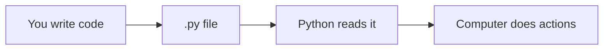

# Chapter 1: Welcome to Programming

If you can follow a recipe, send a text message, or fill out a form, you already think in steps. **Programming** is writing those steps so a **computer** can follow them — very quickly, without getting tired, and without forgetting.

## What Is a Program?

A **program** is a list of instructions. Imagine teaching a robot to make tea:

1. Fill the kettle with water.
2. Turn the kettle on.
3. Wait until the water boils.
4. Pour water into the cup.
5. Add a tea bag.
6. Wait two minutes.
7. Remove the tea bag.

Each line is one **instruction**. The robot reads from top to bottom (usually) and does what you wrote.

A **computer program** works the same way. We write instructions in a **programming language** (we will use **Python**). The computer runs them.



## What Is Code?

**Code** (or **source code**) is the text you write in a programming language.

Example (do not worry if this looks strange — we will explain every word later):

```python
print("Hello!")
```

This tells the computer: **show the text `Hello!` on the screen**.

## Why Learn Programming?

| Reason | Example |
|--------|---------|
| **Automate boring tasks** | Rename 500 files in one click |
| **Build apps and games** | Our Tetris project |
| **Understand the digital world** | How websites and phones “think” |
| **Solve problems** | Analyze data for school or work |

You do **not** need to be “good at math.” You need to be **patient** and willing to experiment.

## Programming Is Like Learning a Language

Think of Python as a foreign language:

- **Vocabulary** — words like `print`, `if`, `while`
- **Grammar** — rules like “put a colon after `if`”
- **Practice** — small programs, then bigger ones

Everyone makes **mistakes**. Even experts. The computer will show **error messages** — they are not insults; they are hints about what to fix.

## What You Need

| Item | Notes |
|------|-------|
| A computer | Windows, Mac, or Linux |
| Internet | For downloading Python (once) |
| Time | 30–60 minutes per chapter is fine |
| A folder | We will call it `my_tetris` later |

You do **not** need a expensive computer or prior IT knowledge.

## How This Tutorial Is Different

We do **not** dump fifty concepts on day one. Instead:

1. One idea per chapter
2. Plain explanations — no unexplained jargon
3. A **Tetris game** that grows as **you** learn

By chapter 30 you will have a playable game in the terminal. By chapter 40, color graphics.

## Try It Yourself (Mindset Exercise)

On paper, write steps for something simple, e.g. “brush teeth” or “order coffee.” Use numbered lines. That list **is** an algorithm — the same kind of thinking as programming.

## Summary

- A **program** is step-by-step instructions for a computer.
- **Code** is those instructions written in a language like Python.
- Mistakes are normal; errors help you learn.
- We will build **Tetris** piece by piece.

**Next:** [What Is Python?](02-what-is-python.html)
