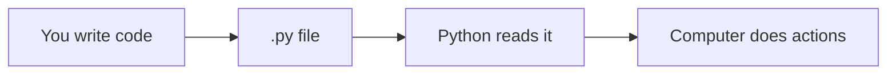

# Chapter 1: Welcome to Programming

If you can follow a recipe, send a text message, or fill out a form, you already think in steps. **Programming** is writing those steps so a **computer** can follow them — very quickly, without getting tired, and without forgetting.

Unlike a person, a computer does not guess what you meant. It follows your instructions **literally**. That sounds strict, but it is also why programs can repeat the same task millions of times without slipping up.

## What Is a Program?

A **program** is a list of instructions. Imagine teaching a robot to make tea:

1. Fill the kettle with water.
2. Turn the kettle on.
3. Wait until the water boils.
4. Pour water into the cup.
5. Add a tea bag.
6. Wait two minutes.
7. Remove the tea bag.

Each line is one **instruction**. The robot reads from top to bottom (usually) and does what you wrote.

Notice what is missing from that list: the robot does not "know" what tea is. You must spell out every step. If you forget "turn the kettle on," you get cold water — not because the robot is lazy, but because you left out a step. Programming works the same way.

A **computer program** works the same way. We write instructions in a **programming language** (we will use **Python**). The computer runs them.



### Step-by-step: what happens when you run a program

1. You type instructions into a file and save it.
2. You tell Python to run that file.
3. Python reads line 1, then line 2, and so on.
4. Each line may show text, do math, wait for a key press, or change data in memory.
5. When Python reaches the end (or hits an error), the program stops.

You do not need to understand every detail yet. The important idea is **order**: instructions run in sequence unless a later chapter introduces loops and branches.

## What Is Code?

**Code** (or **source code**) is the text you write in a programming language.

Example (do not worry if this looks strange — we will explain every word later):

```python
print("Hello!")
# expected output: Hello!
```

This tells the computer: **show the text `Hello!` on the screen**.

Code lives in plain text files. There are no hidden magic buttons inside the file — what you see is what Python reads. That is why spelling and punctuation matter: `print` works; `prnt` does not.

## Why Learn Programming?

| Reason | Example |
|--------|---------|
| **Automate boring tasks** | Rename 500 files in one click |
| **Build apps and games** | Our Tetris project |
| **Understand the digital world** | How websites and phones "think" |
| **Solve problems** | Analyze data for school or work |

You do **not** need to be "good at math." You need to be **patient** and willing to experiment.

Many beginners worry they are "not technical enough." Programming is less about being smart and more about being **curious**: try something, see what happens, adjust, try again. That loop is the job.

### A small analogy: programming vs using apps

Using an app is like riding a bus — you pick a destination someone else planned. Programming is like **drawing the map** and deciding where the bus stops. Tetris is our map: you will decide how pieces move, when rows clear, and when the game ends.

## Programming Is Like Learning a Language

Think of Python as a foreign language:

- **Vocabulary** — words like `print`, `if`, `while`
- **Grammar** — rules like "put a colon after `if`"
- **Practice** — small programs, then bigger ones

Everyone makes **mistakes**. Even experts. The computer will show **error messages** — they are not insults; they are hints about what to fix.

When you learn a spoken language, you mispronounce words at first. In Python, you mis-type words at first. Both are normal. The difference is that Python always tells you **exactly** which line confused it, which is actually helpful once you know where to look.

## What You Need

| Item | Notes |
|------|-------|
| A computer | Windows, Mac, or Linux |
| Internet | For downloading Python (once) |
| Time | 30–60 minutes per chapter is fine |
| A folder | We will call it `my_tetris` later |

You do **not** need a expensive computer or prior IT knowledge.

A laptop from several years ago is enough for this entire tutorial, including text Tetris. Graphical Tetris later needs a normal modern machine, but nothing exotic.

## How This Tutorial Is Different

We do **not** dump fifty concepts on day one. Instead:

1. One idea per chapter
2. Plain explanations — no unexplained jargon
3. A **Tetris game** that grows as **you** learn

By chapter 30 you will have a playable game in the terminal. By chapter 40, color graphics.

Each new chapter adds **one layer** to the same project. You are not throwing away yesterday's work — you are **building on it**. That is how real software grows too: start simple, add features, refactor when things get messy.

## Common Mistakes (Mindset)

| Mistake | What to do instead |
|---------|-------------------|
| "I should understand everything immediately" | Re-read one section; run the examples |
| "Errors mean I'm bad at this" | Errors mean Python is pointing at a fix |
| "I'll memorize all of Python first" | Learn by writing small programs |
| "Real programmers never get stuck" | They get stuck; they just know how to debug |

If you feel lost, stop and write **one** line of code that works — even `print("still here")`. Momentum beats perfection.

## Try It Yourself (Mindset Exercise)

On paper, write steps for something simple, e.g. "brush teeth" or "order coffee." Use numbered lines. That list **is** an algorithm — the same kind of thinking as programming.

Go further: pick one step that is vague ("brush well") and rewrite it so a robot could not misunderstand. For example: "Move brush in circles on front teeth for 30 seconds." That is the same skill you will use when telling Tetris **exactly** when a row is full.

## Summary

- A **program** is step-by-step instructions for a computer.
- **Code** is those instructions written in a language like Python.
- Mistakes are normal; errors help you learn.
- We will build **Tetris** piece by piece.

**Next:** [What Is Python?](02-what-is-python.md)
