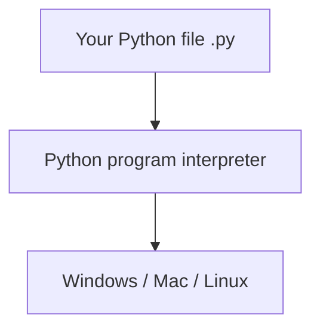

# Chapter 2: What Is Python?

**Python** is a **programming language** — a way to write instructions humans can read and computers can run. It is one of the most popular languages in the world, and one of the **best for beginners**.

Python was designed so that **reading code** feels close to reading plain English. You spend less time fighting strange symbols and more time solving problems — like making a falling block land in the right column.

## Why Python for Beginners?

| Feature | Why it helps you |
|---------|------------------|
| **Readable** | Looks closer to English than many languages |
| **Free** | No license fee |
| **Everywhere** | Web, science, games, automation, AI |
| **Huge community** | Millions of tutorials and answers online |
| **Less boilerplate** | You write ideas, not pages of setup |

Compare:

```python
# Python
print("Hello")
# expected output: Hello
```

Other languages often need more "ceremony" before you see results. Python lets you **start small**.

"Boilerplate" means extra setup code you must write before the interesting part. In Python, your first useful program can be a single line. That quick feedback keeps you motivated while concepts are still new.

## What Is Python Used For?

- **Websites** — Instagram, parts of YouTube
- **Science and medicine** — analyzing experiments
- **Games and tools** — including our Tetris
- **Everyday scripts** — organizing files, sending emails
- **Artificial intelligence** — many courses use Python

You are learning a **real** skill used in industry, not a toy language.

Our Tetris game uses the **same building blocks** as large projects: variables, loops, functions, and later classes. The scale is smaller, but the ideas transfer.

## Python vs "The Computer"



You install **Python** once. It reads your `.py` files and tells the operating system what to do (show text, read keys, draw windows, etc.).

Think of Python as a **translator**. You write in Python; the interpreter converts your instructions into actions the operating system understands. You rarely talk to the hardware directly — Python handles that layer for you.

## The Python Shell (REPL) — A Quick Peek

After installing Python (next part), you can type one line and see instant results:

```python
>>> 2 + 2
4
>>> print("Hi")
Hi
```

`>>>` means "Python is waiting for your next line." We will use **files** for Tetris, but the shell is handy for quick experiments.

**REPL** stands for Read–Eval–Print Loop: Python reads what you typed, evaluates it, prints the result, and loops back for more. It is like a calculator that also understands full sentences of code.

### When to use the shell vs a file

| Use the shell when… | Use a `.py` file when… |
|---------------------|------------------------|
| Testing `2 + 2` or one `print` | Building Tetris (many lines) |
| Checking if a function name exists | Saving work to run again |
| Quick "what happens if…?" | Sharing code with others |

## Python 2 vs Python 3

Always use **Python 3**. Python 2 is old and unsupported. When we say "Python," we mean **Python 3**.

Check your version later with:

```bash
python3 --version
# expected output example: Python 3.12.4
```

You want **3.10** or newer.

Old tutorials may still mention Python 2. If you see `print "hello"` without parentheses, that is Python 2 syntax — skip that material.

## Files and Extensions

Python programs usually live in files ending with **`.py`**:

```
hello.py
tetris.py
```

The name before `.py` is your choice (use letters, numbers, underscores; no spaces).

Good names describe the file's job: `board.py` for drawing the grid, `shapes.py` for piece definitions. Avoid names like `test1.py` once you have several files — future-you will forget what `test1` was for.

## How Python Runs Your File (Walkthrough)

1. Open a terminal and go to the folder containing `hello.py`.
2. Run `python3 hello.py` (or `python hello.py` on Windows).
3. Python opens the file, reads it from top to bottom, and executes each statement.
4. Output appears in the terminal; then Python exits.

No separate "compile" step is required for beginners. You save, you run, you see results. That tight loop is ideal for learning.

## Common Mistakes

| Mistake | Fix |
|---------|-----|
| Saving as `hello.txt` instead of `hello.py` | Use `.py` extension |
| Running Python 2 by accident | Use `python3` on Mac/Linux |
| Spaces in file names (`my game.py`) | Use underscores: `my_game.py` |
| Expecting `.py` files to double-click and pause | Run from terminal or editor |

## What We Will Not Cover Yet

- Advanced math
- Computer hardware deep dives
- Professional deployment

We focus on **thinking like a programmer** and **building Tetris**.

## Try It Yourself

Search online for "Python success stories" or "what is Python used for" — pick one example that interests you. Write one sentence: why you want to learn Python.

Optional: write a second sentence connecting that goal to Tetris. Example: "I want to automate tasks at work, and Tetris teaches me the same loop-and-logic patterns."

## Summary

- **Python** is a popular, beginner-friendly programming language.
- You write `.py` files; the **Python interpreter** runs them.
- Use **Python 3** only.
- Next we map how Tetris connects to each concept you will learn.

**Next:** [Your Tetris Learning Journey](03-your-tetris-journey.md)
