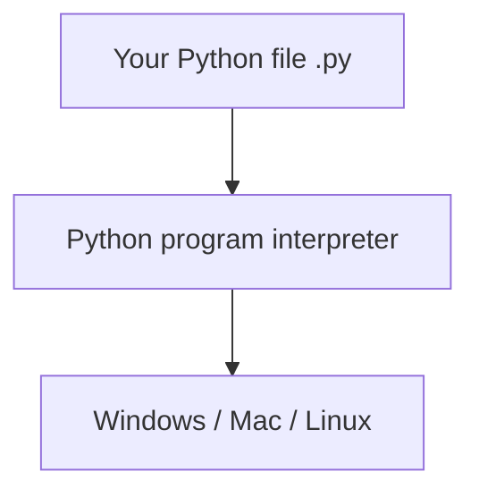

# Chapter 2: What Is Python?

**Python** is a **programming language** — a way to write instructions humans can read and computers can run. It is one of the most popular languages in the world, and one of the **best for beginners**.

## Why Python for Beginners?

| Feature | Why it helps you |
|---------|------------------|
| **Readable** | Looks closer to English than many languages |
| **Free** | No license fee |
| **Everywhere** | Web, science, games, automation, AI |
| **Huge community** | Millions of tutorials and answers online |
| **Less boilerplate** | You write ideas, not pages of setup |

Compare:

```python
# Python
print("Hello")
```

Other languages often need more “ceremony” before you see results. Python lets you **start small**.

## What Is Python Used For?

- **Websites** — Instagram, parts of YouTube
- **Science and medicine** — analyzing experiments
- **Games and tools** — including our Tetris
- **Everyday scripts** — organizing files, sending emails
- **Artificial intelligence** — many courses use Python

You are learning a **real** skill used in industry, not a toy language.

## Python vs “The Computer”



You install **Python** once. It reads your `.py` files and tells the operating system what to do (show text, read keys, draw windows, etc.).

## The Python Shell (REPL) — A Quick Peek

After installing Python (next part), you can type one line and see instant results:

```python
>>> 2 + 2
4
>>> print("Hi")
Hi
```

`>>>` means “Python is waiting for your next line.” We will use **files** for Tetris, but the shell is handy for quick experiments.

## Python 2 vs Python 3

Always use **Python 3**. Python 2 is old and unsupported. When we say “Python,” we mean **Python 3**.

Check your version later with:

```bash
python3 --version
```

You want **3.10** or newer.

## Files and Extensions

Python programs usually live in files ending with **`.py`**:

```
hello.py
tetris.py
```

The name before `.py` is your choice (use letters, numbers, underscores; no spaces).

## What We Will Not Cover Yet

- Advanced math
- Computer hardware deep dives
- Professional deployment

We focus on **thinking like a programmer** and **building Tetris**.

## Try It Yourself

Search online for “Python success stories” or “what is Python used for” — pick one example that interests you. Write one sentence: why you want to learn Python.

## Summary

- **Python** is a popular, beginner-friendly programming language.
- You write `.py` files; the **Python interpreter** runs them.
- Use **Python 3** only.
- Next we map how Tetris connects to each concept you will learn.

**Next:** [Your Tetris Learning Journey](03-your-tetris-journey.html)
