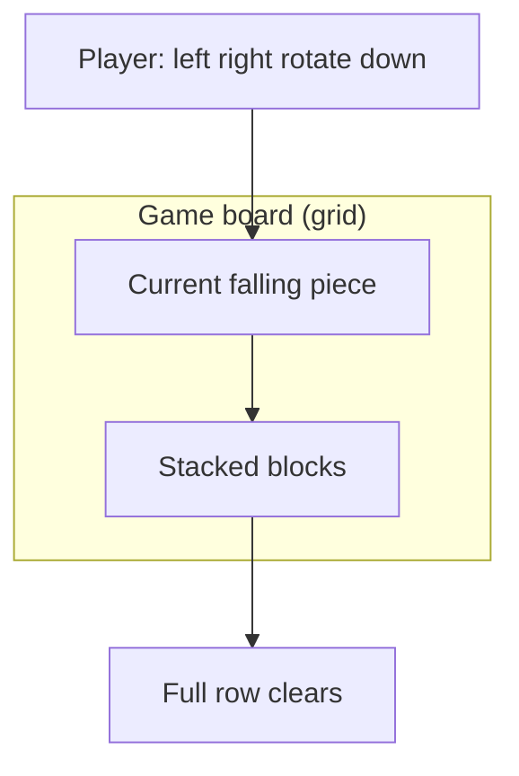

# Chapter 3: Your Tetris Learning Journey

This chapter is your **road map**. Tetris is not a surprise project at the end — it is the **spine** of the whole tutorial. Here is how each programming idea shows up in the game.

## What Is Tetris? (Quick Reminder)

Colored shapes (**tetrominoes**) fall into a **well** (a vertical grid). You move and rotate them. When a **row is completely filled**, it disappears. The game ends when blocks stack to the top.



## Concept → Tetris Connection

| You learn | Role in Tetris |
|-----------|----------------|
| **print** | Show the board as text |
| **Numbers** | Score, row/column positions |
| **Strings** | Symbols like `#` for blocks, `.` for empty |
| **Variables** | Piece position `x`, `y` |
| **if / else** | “Is this cell empty?” “Game over?” |
| **while** | Main game loop — keep running until over |
| **for** | Draw each row; check each cell |
| **Lists** | One row of the board |
| **2D list** | Whole grid |
| **Functions** | `draw_board()`, `move_piece()` |
| **Classes** | A `Piece` object with its own data |

## Our Two Versions

### Version 1 — Text Tetris (Part 9–10)

The board prints in the **terminal** using characters:

```
..........
..........
....##....
...####...
```

**Why start here?**

- No graphics library yet — fewer moving parts
- Easy to **see** data structures
- Easier to **debug** (print what you need)

### Version 2 — Graphical Tetris (Part 12)

We add **Pygame** — colored squares, smoother movement, keyboard in a window.

Same **logic**, prettier **display**.

## File Growth Plan

Create a folder `my_tetris/` and add code as we go:

| Chapter | New file / addition |
|---------|---------------------|
| Setup | `hello.py` |
| Drawing grid | `board.py` |
| Shapes | `shapes.py` |
| Game loop | `tetris.py` (main file grows) |
| Classes | refactor into `piece.py`, `game.py` |
| Pygame | `tetris_gui.py` |

You may use one big file at first — splitting comes later.

## Pace and Expectations

- **Parts 1–8** — no full game yet; small examples (normal!)
- **Part 9** — you see the board on screen
- **Part 10** — you can **play** text Tetris
- **Part 11** — code gets cleaner with classes
- **Part 12** — color version

If something feels hard, **re-read** the previous chapter. Programming is cumulative.

## Rules of Thumb While Learning

1. **Run code often** — after every few lines
2. **Change one thing** — see what breaks or improves
3. **Read error messages** — they name the line number
4. **Take breaks** — fresh eyes fix bugs faster

## Try It Yourself

Create an empty folder on your computer named `my_tetris`. Inside, make a text file `notes.txt` and write: “I will finish text Tetris by [your date].”

## Summary

- Tetris teaches **grid**, **logic**, **loops**, and **structure**
- We build **text Tetris first**, then **graphical**
- Keep all project files in **`my_tetris/`**
- Next: install Python and tools

**Next:** [Install Python](../part2-setup/01-install-python.html)
