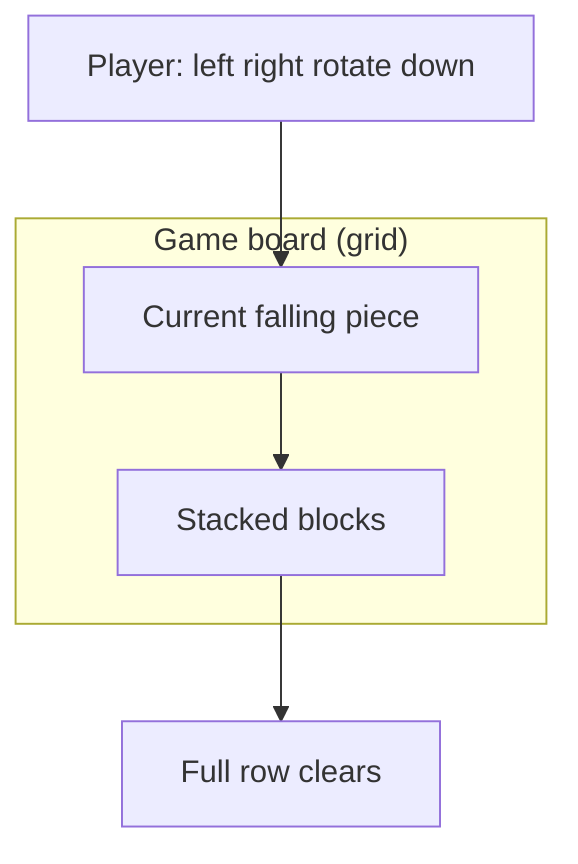

# Chapter 3: Your Tetris Learning Journey

This chapter is your **road map**. Tetris is not a surprise project at the end — it is the **spine** of the whole tutorial. Here is how each programming idea shows up in the game.

Reading this chapter once now, and again after Part 5, helps you see how small exercises connect to a full game. When a chapter feels abstract, come back here and find the Tetris column in the table below.

## What Is Tetris? (Quick Reminder)

Colored shapes (**tetrominoes**) fall into a **well** (a vertical grid). You move and rotate them. When a **row is completely filled**, it disappears. The game ends when blocks stack to the top.



Each frame of the game repeats a pattern: read input → move piece → lock piece if it cannot fall → clear full rows → draw the board. That repeating pattern is a **game loop**, and you will write one yourself.

## Concept → Tetris Connection

| You learn | Role in Tetris |
|-----------|----------------|
| **print** | Show the board as text |
| **Numbers** | Score, row/column positions |
| **Strings** | Symbols like `#` for blocks, `.` for empty |
| **Variables** | Piece position `x`, `y` |
| **if / else** | "Is this cell empty?" "Game over?" |
| **while** | Main game loop — keep running until over |
| **for** | Draw each row; check each cell |
| **Lists** | One row of the board |
| **2D list** | Whole grid |
| **Functions** | `draw_board()`, `move_piece()` |
| **Classes** | A `Piece` object with its own data |

Nothing in this table is decoration. When you learn `if`, you will immediately ask "can this piece move left?" When you learn lists, you will store one row of the grid. The game gives every concept a **reason to exist**.

## Our Two Versions

### Version 1 — Text Tetris (Part 9–10)

The board prints in the **terminal** using characters:

```
..........
..........
....##....
...####...
```

**Why start here?**

- No graphics library yet — fewer moving parts
- Easy to **see** data structures
- Easier to **debug** (print what you need)

In text mode, the "graphics" are just strings. If the board looks wrong, you can print the raw grid and read it like a spreadsheet. That visibility is worth more than fancy pixels while you are learning logic.

### Version 2 — Graphical Tetris (Part 12)

We add **Pygame** — colored squares, smoother movement, keyboard in a window.

Same **logic**, prettier **display**.

Most of your Part 9–10 code **stays the same** in spirit: grid, collision, scoring. We swap `print` for drawing rectangles. You will not throw away everything and start over — you will **upgrade the front end**.

## File Growth Plan

Create a folder `my_tetris/` and add code as we go:

| Chapter | New file / addition |
|---------|---------------------|
| Setup | `hello.py` |
| Drawing grid | `board.py` |
| Shapes | `shapes.py` |
| Game loop | `tetris.py` (main file grows) |
| Classes | refactor into `piece.py`, `game.py` |
| Pygame | `tetris_gui.py` |

You may use one big file at first — splitting comes later.

### Step-by-step: your folder over time

1. **Today (Part 2):** `my_tetris/hello.py` and maybe `notes.txt`.
2. **Part 3–8:** small demo files like `output_demo.py`, `greet.py` — practice, not the full game yet.
3. **Part 9:** `board.py` draws rows of `.` and `#`.
4. **Part 10:** `tetris.py` ties movement, clearing, and game over together.
5. **Part 11–12:** split and polish; add `tetris_gui.py` when Pygame arrives.

Do not worry if your folder looks messy mid-way. Real projects grow messy before they get organized.

## Pace and Expectations

- **Parts 1–8** — no full game yet; small examples (normal!)
- **Part 9** — you see the board on screen
- **Part 10** — you can **play** text Tetris
- **Part 11** — code gets cleaner with classes
- **Part 12** — color version

If something feels hard, **re-read** the previous chapter. Programming is cumulative.

A playable text Tetris around Part 10 is the first big milestone. Before that, every chapter is laying **one brick** — output, numbers, strings, variables, loops. Skipping chapters to "get to the game faster" usually slows you down because later code assumes earlier ideas.

## Rules of Thumb While Learning

1. **Run code often** — after every few lines
2. **Change one thing** — see what breaks or improves
3. **Read error messages** — they name the line number
4. **Take breaks** — fresh eyes fix bugs faster

When debugging Tetris, ask: "Is the **data** wrong (grid values) or the **display** wrong (how I print)?" Separating those two questions saves hours.

## Common Mistakes

| Mistake | Better approach |
|---------|-----------------|
| Comparing your progress to online experts | They also started with `print("Hello")` |
| Skipping exercises because Tetris feels far away | Exercises train muscles the game needs |
| One giant coding session until burnout | Short daily sessions beat rare marathons |
| Deleting code when frustrated | Comment it out or save a copy first |

## Try It Yourself

Create an empty folder on your computer named `my_tetris`. Inside, make a text file `notes.txt` and write: "I will finish text Tetris by [your date]."

Add three bullet goals below that date, for example: run `hello.py`, draw a 10-wide row of dots, move one block left/right. Small checkpoints keep the road map concrete.

## Summary

- Tetris teaches **grid**, **logic**, **loops**, and **structure**
- We build **text Tetris first**, then **graphical**
- Keep all project files in **`my_tetris/`**
- Next: install Python and tools

**Next:** [Install Python](../part2-setup/01-install-python.md)
