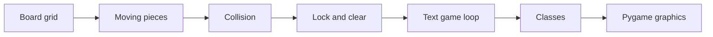

# Chapter 41: Congratulations and Next Steps

You started with **no programming experience**. You now understand how real software is structured — and you built **Tetris** twice (text and graphics).

That is not a small achievement. Many tutorials stop at `"Hello, world"`. You finished a loop-driven game with collision, state, scoring, classes, and a graphical front end. Employers and teachers notice **finished projects** more than half-read textbooks.

## What You Learned

| Concept | Where you used it |
|---------|-------------------|
| Variables | score, position |
| Types | int, str, bool, list, dict |
| if / else | collision, game over |
| while / for | game loop, drawing grid |
| Functions | make_board, can_place |
| Lists & 2D grids | board |
| Classes | Piece, Game |
| Libraries | pygame, random |
| Tools | Python, VS Code, pip, venv |

Each row in the table is a tool you can reuse. A web app still uses variables and loops. Data scripts still use functions and lists. Tetris was practice ground for ideas that appear everywhere in software.

## Skills Beyond Syntax

Syntax fades if you do not use it daily — that is normal. These habits stay:

- **Breaking problems into steps** — movement, then collision, then lock, then clear lines.
- **Reading error messages** — tracebacks point to line numbers; read from bottom up.
- **Testing small pieces before combining** — `can_place` alone before the full loop.
- **Refactoring** when code gets messy — dict to classes without changing gameplay.

These matter more than memorizing every function name. Professional developers search documentation constantly. What separates them is knowing **how to narrow a bug** and **how to finish**.

## Your Tetris Journey (Recap)



You climbed that ladder one chapter at a time. Future projects can follow the same path: core logic first, polish second.

## Where to Go Next

| Interest | Suggestion |
|----------|------------|
| More games | Pygame tutorials, `arcade` library |
| Web | Flask or Django basics |
| Data / science | pandas, Jupyter notebooks |
| Automation | Script file renaming, spreadsheets |
| Courses | freeCodeCamp, CS50 Python, Automate the Boring Stuff |
| Practice | [Exercism Python](https://exercism.org/tracks/python), [Advent of Code](https://adventofcode.com/) |

Pick **one** direction and go deep for a few weeks. Shallow dabbling in ten frameworks teaches less than one small project in one area.

## Improve Your Tetris

Your game is complete enough to share — and rich enough to extend:

- **Hold piece** — store one shape aside for later (advanced state).
- **Next preview** — show upcoming piece in the sidebar you reserved with extra screen width.
- **High score file** — you may have added this in Chapter 35; display it in the Pygame HUD.
- **Levels increasing speed** — tie `FALL_SPEED` to lines cleared.
- **Mobile-friendly** — touch controls (advanced; different library).

Treat each feature as a mini chapter: implement, playtest, commit. Same rhythm as this tutorial.

## Join Communities

Learning alone works, but questions get answered faster with peers:

- Local Python meetups — search Meetup.com or university clubs.
- r/learnpython — be polite, show your code when asking, say what you tried.
- Stack Overflow for specific errors — search first; post a minimal reproducible example.

When asking for help, include error text and a short code snippet. "My Tetris rotation breaks" plus ten lines beats "it doesn't work."

## Keep a Portfolio

Put `my_tetris` on GitHub:

1. Create repository
2. Add README with screenshot and how to run (`python tetris.py`, `python run_gui.py`)
3. Share with teachers or employers

A README might include:

```markdown
# My Tetris

Text and Pygame versions of Tetris built while learning Python.

## Run
pip install -r requirements.txt
python tetris.py      # terminal version
python run_gui.py     # pygame version
```

Screenshots prove the project runs. Install steps respect anyone cloning your repo.

## Common Next-Project Ideas

If you want another game-shaped challenge without starting from zero:

| Project | Reuses from Tetris |
|---------|-------------------|
| Snake | grid, loop, collision |
| Breakout | pygame rects, input |
| 2048 | 2D list, merge logic |
| Minesweeper | grid reveal, win/lose state |

Or leave games entirely — automate boring files on your computer, or fetch weather with `requests`. The loop is always: small step, test, repeat.

## Final Words

Programming is **learned by doing**. You will forget syntax — that is what **documentation** is for. What stays is **how to think** in steps, how to debug, and how to finish projects.

You proved you can finish. The next project will feel hard at first too — and you already know how that story ends when you keep going.

Thank you for learning with Easy Python. Now go build something **you** care about — a tool, a game, a script for a friend. The same Python you used here is waiting.

---

[Back to tutorial home](../index.md)
