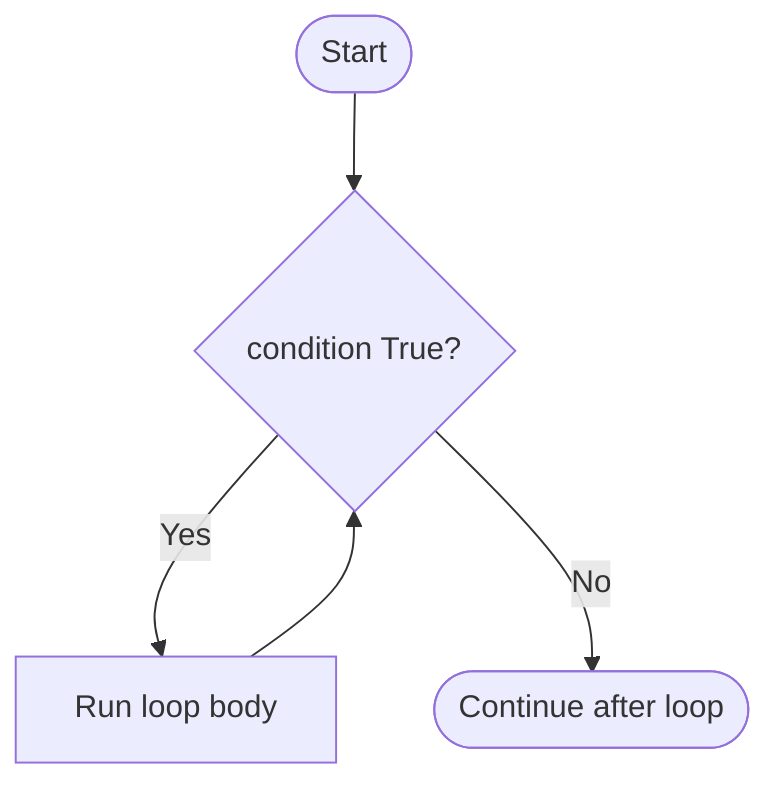

# Chapter 18: while Loops

A **loop** repeats code. **`while`** repeats **as long as** a condition is True — perfect for “keep playing until game over.”

## Basic while

```python
count = 0
while count < 5:
    print("Count is", count)
    count += 1
print("Done")
```

Output: 0, 1, 2, 3, 4 then Done.

## Flow



## Infinite Loop Danger

```python
while True:
    print("Forever")  # only stop with Ctrl+C
```

Always ensure something inside **changes** the condition or **breaks**.

## break — Exit Early

```python
while True:
    cmd = input("Command (q=quit): ")
    if cmd == "q":
        break
    print("You typed:", cmd)
```

## continue — Skip Rest of Iteration

```python
n = 0
while n < 5:
    n += 1
    if n == 3:
        continue
    print(n)
# prints 1,2,4,5 — skips 3
```

## Tetris Game Loop (Skeleton)

```python
game_over = False
piece_y = 0

while not game_over:
    print(f"Piece row: {piece_y}")
    cmd = input("Move (s=down, q=quit): ")
    if cmd == "q":
        game_over = True
    elif cmd == "s":
        piece_y += 1
        if piece_y >= 19:
            game_over = True
            print("Hit bottom — game over")
```

Real Tetris adds board, collision, new pieces.

## Try It Yourself

Write a loop that:

1. Starts `score = 0`
2. Each iteration adds 100 to score and prints it
3. Stops when `score >= 500`

## Summary

- **`while condition:`** repeats while True.
- **`break`** exits loop; **`continue`** skips to next round.
- Tetris **main loop** runs until `game_over`.
- Next: **`for`** loops.

**Next:** [for Loops and range](02-for-loops.html)
