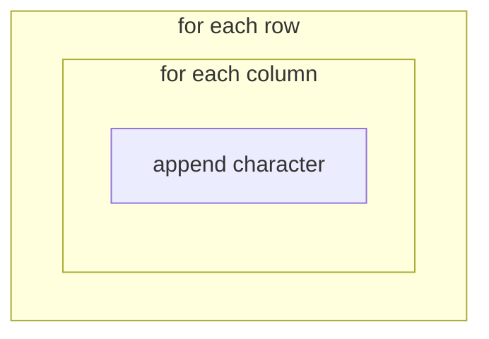

# Chapter 19: for Loops and range

**`for`** loops repeat once **for each item** in a sequence — ideal for **each row** of the board or **each cell** in a row.

Where `while` waits for a condition to fail, `for` says “do this N times” or “do this for every element.” Drawing a grid is the classic `for` job.

## for with range

```python
for i in range(5):
    print(i)
```

Expected output (one number per line):

```
0
1
2
3
4
```

`range(5)` means “five numbers starting at 0.” It does **not** include 5 — same off-by-one rule as valid columns `0..9` on a width-10 board.

### range variants

```python
print(list(range(10)))       # expected: [0, 1, ..., 9]
print(list(range(2, 10)))    # expected: [2, 3, ..., 9]
print(list(range(0, 10, 2))) # expected: [0, 2, 4, 6, 8] — step 2
```

Third argument is **step**. `range(10, 0, -1)` counts down — handy when removing rows from bottom to top later.

## Drawing Board Rows (Preview)

```python
BOARD_HEIGHT = 5
for row in range(BOARD_HEIGHT):
    print(row, "..........")
```

Expected output:

```
0 ..........
1 ..........
2 ..........
3 ..........
4 ..........
```

Each row prints its index and a placeholder line. Next step: inner loop fills each column with `.` or `#`.

## for over a string

```python
for char in "Tetris":
    print(char)
```

Expected output: `T`, `e`, `t`, `r`, `i`, `s` on separate lines. Strings are sequences of characters — `for` visits each one left to right.

Useful for validating piece names:

```python
shape = "I"
for letter in shape:
    print(letter)
# expected output: I
```

## Nested Loops — Grid

```python
for row in range(3):
    line = ""
    for col in range(5):
        line += "."
    print(line)
```

Expected output: three lines of five dots — miniature empty board.



Outer loop picks the row; inner loop builds one horizontal line. Total cells visited: 3 × 5 = 15 — product of both ranges.

### Walkthrough — one cell at a time

When `row = 0`, inner loop runs `col` 0,1,2,3,4 — appends five dots. Outer loop advances `row` to 1 and repeats. No variable tracks “cell 7” globally — `row` and `col` together name each spot.

## Using row and col in the body

```python
WIDTH = 4
HEIGHT = 3
for row in range(HEIGHT):
    line = ""
    for col in range(WIDTH):
        if row == 0 and col == 0:
            line += "#"  # one filled corner
        else:
            line += "."
    print(line)
```

Expected output:

```
#...
....
....
```

Combining nested `for` with `if` is how you draw piece shapes on a grid.

## for vs while

| Use **for** when | Use **while** when |
|------------------|-------------------|
| Known repetitions | Repeat until condition changes |
| Each item in list | Game loop until game over |
| Drawing every row/column | Waiting for quit or `game_over` |

Game loop often `while`; drawing grid often `for`. Many programs use both in the same file.

## The _ Throwaway Variable

```python
for _ in range(3):
    print("Tick")
```

Expected output: three lines of `Tick`. `_` signals “I need three iterations, not the index value.”

## Common Mistakes

**Thinking range(10) includes 10**

Valid columns: `range(10)` → 0..9. Column 10 is out of bounds.

**Wrong indent on inner loop**

```python
for row in range(3):
    line = ""
for col in range(5):  # wrong — not inside row loop
    line += "."
```

Inner `for` must be indented under outer `for` to build each line inside its row.

**Modifying loop variable expecting it to change the range**

```python
for i in range(5):
    i = 99  # does not change how many times the loop runs
    print(i)
```

## Try It Yourself

Print a 10×4 grid of `.` characters (10 wide, 4 tall) using nested loops.

Expected: four lines, each ten dots long. Optional: print row numbers at the start of each line for debugging.

## Summary

- **`for x in range(n):`** repeats n times with index starting at 0.
- **Nested loops** build 2D grids — outer row, inner column.
- **`range(start, stop, step)`** controls which numbers you visit.
- Drawing Tetris board = loop rows, loop columns, pick character per cell.
- Next: common loop patterns.

**Next:** [Loop Patterns You Will Use Often](03-loop-patterns.md)
