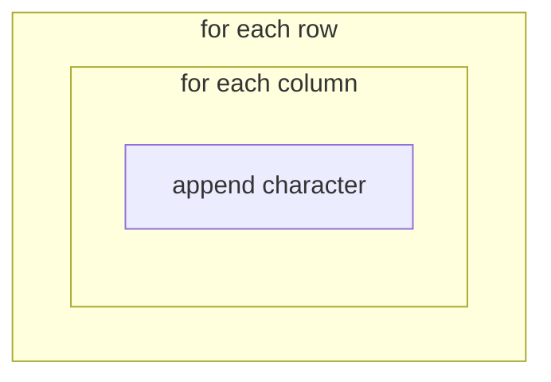

# Chapter 19: for Loops and range

**`for`** loops repeat once **for each item** in a sequence — ideal for **each row** of the board or **each cell** in a row.

## for with range

```python
for i in range(5):
    print(i)
```

Prints `0` through `4`.

`range(5)` means “five numbers starting at 0.”

### range variants

```python
range(10)       # 0..9
range(2, 10)    # 2..9
range(0, 10, 2) # 0,2,4,6,8 — step 2
```

## Drawing Board Rows (Preview)

```python
BOARD_HEIGHT = 5
for row in range(BOARD_HEIGHT):
    print(row, "..........")
```

## for over a string

```python
for char in "Tetris":
    print(char)
```

## Nested Loops — Grid

```python
for row in range(3):
    line = ""
    for col in range(5):
        line += "."
    print(line)
```

3 rows × 5 columns of dots — miniature empty board.



## for vs while

| Use **for** when | Use **while** when |
|------------------|-------------------|
| Known repetitions | Repeat until condition changes |
| Each item in list | Game loop until game over |

Game loop often `while`; drawing grid often `for`.

## Try It Yourself

Print a 10×4 grid of `.` characters (10 wide, 4 tall) using nested loops.

## Summary

- **`for x in range(n):`** repeats n times with index.
- **Nested loops** build 2D grids.
- Drawing Tetris board = loop rows, loop columns.
- Next: common loop patterns.

**Next:** [Loop Patterns You Will Use Often](03-loop-patterns.html)
