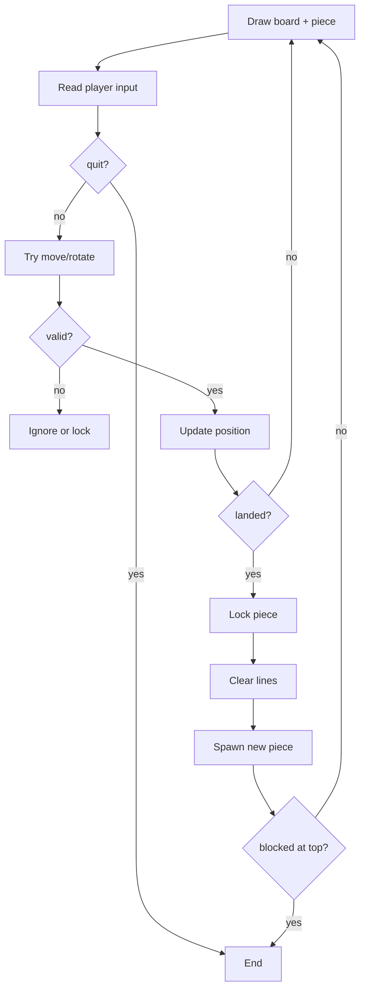

# Chapter 27: How Tetris Works — Big Picture

You know Python basics. Now we assemble **Tetris logic** — still in plain language before heavy code.

Tetris is not one trick — it is a **loop** that repeats the same story: show the world, listen to the player, apply rules, update state, repeat. You already have the building blocks: lists for rows, list-of-lists for the board, dicts for shapes and controls, functions to name each step.

## Game State

At any moment we track:

| State | Meaning |
|-------|---------|
| `board` | Locked blocks (2D grid) |
| `piece_row`, `piece_col` | Current piece anchor |
| `shape_name` | I, O, T, S, Z, J, L |
| `shape_offsets` | List of (dr, dc) for blocks |
| `score`, `lines` | Progress |
| `game_over` | Stop loop? |

Think of **state** as a snapshot of the game at one instant — like a save file. The loop reads state, changes a few variables, draws again. Nothing magical: just variables updated in order.

You can even bundle state in one dictionary later (`state["board"]`, `state["score"]`) — same idea, neater carrying handle.

## One Frame (One Turn in Text Version)



Walk through one slow turn:

1. **Draw** — player sees locked blocks plus falling piece (overlay, not merged yet).
2. **Input** — player presses `d` for right, or `s` to drop one row.
3. **Validate** — if move hits a wall or block, ignore it (or lock if drop failed).
4. **Update** — change `piece_row` / `piece_col` or rotation index.
5. **Land check** — if piece cannot move down, **lock** it onto `board`, clear full lines, spawn next piece.
6. **Game over** — if new piece spawns blocked, stop.

Text Tetris does all of this with `print` and `input()` — one turn per keypress. Pygame later swaps input/drawing but keeps this flow.

## Locked vs Falling

- **Board** cells: only locked blocks (and empty `.`).
- **Falling piece** drawn **on top** when displaying — not copied to board until **lock**.

Why separate?

- Moving left/right only changes `piece_col` — fast, no board surgery.
- Drawing merges piece onto a **copy** for display; real board stays clean until lock.
- Collision checks ask: "If I moved here, would any cell hit `#` or the edge?"

Analogy: falling piece is a **sticker** you slide over a photograph. The photograph (`board`) only changes when you press down to glue the sticker permanently (**lock**).

## Rotation (Simplified)

We store each shape in **four rotations** as lists of offsets. Press `w` → next rotation index (0→1→2→3→0).

Full rotation math can wait; **lookup tables** are fine for learning.

Before accepting a rotation, run the same **can place** check as a move. If rotation overlaps a block, keep the old rotation — do not half-spin inside a wall.

## Gravity and Soft Drop

Each frame (or each press of `s`), try moving the piece **one row down**. If that move is illegal, the piece **lands**: lock, clear lines, spawn next.

In text mode you might tie gravity to the player pressing `s` repeatedly. Real-time drop timers come later — the logic is identical: try down, else lock.

## Text vs Graphics

| Text Tetris | Pygame Tetris |
|-------------|---------------|
| `print` grid | colored rectangles |
| `input()` per move | key events |
| Same logic | Same logic |

The **rules** — board, shapes, collision, line clear — transfer directly. You are learning the engine, not the paint.

## Files for Part 9–10

```
my_tetris/
  constants.py   # WIDTH, HEIGHT
  shapes.py      # SHAPES dict
  board.py       # make, draw, lock, clear
  tetris.py      # main loop
```

You may merge into fewer files while learning. Splitting helps you find `draw_board` without scrolling through spawn logic.

Suggested build order:

1. `constants.py` — one source of truth for sizes.
2. `board.py` — empty grid and draw.
3. `shapes.py` — piece geometry.
4. `tetris.py` — loop that wires everything.

## Common Mistakes (Design Level)

| Mistake | Effect | Prevention |
|---------|--------|------------|
| Drawing piece into `board` before lock | Ghost blocks when moving | Overlay on copy only |
| No collision check | Pieces pass through walls | `can_place` before every move |
| Spawning inside blocks | Instant game over confusion | Test spawn with `is_cell_free` |
| One 800-line file | Hard to debug | Split by job: board, shapes, main |

## Try It Yourself

Draw the flowchart on paper with your own words. Label which steps you already know how to code.

Mark each box: **done**, **partly**, or **later**. You should recognize draw, lists, and functions in several boxes already.

## Summary

- Tetris = **loop** + **state** + **rules**.
- Falling piece separate until **lock**.
- Same logic for text and graphical versions.
- Next: implement **board** and **constants**.

**Next:** [Building the Board](02-the-board.md)
