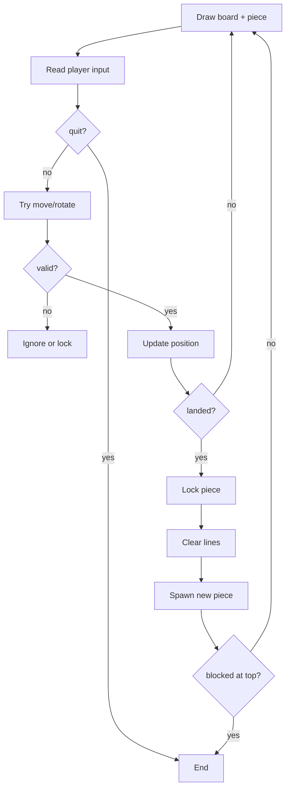

# Chapter 27: How Tetris Works — Big Picture

You know Python basics. Now we assemble **Tetris logic** — still in plain language before heavy code.

## Game State

At any moment we track:

| State | Meaning |
|-------|---------|
| `board` | Locked blocks (2D grid) |
| `piece_row`, `piece_col` | Current piece anchor |
| `shape_name` | I, O, T, S, Z, J, L |
| `shape_offsets` | List of (dr, dc) for blocks |
| `score`, `lines` | Progress |
| `game_over` | Stop loop? |

## One Frame (One Turn in Text Version)



## Locked vs Falling

- **Board** cells: only locked blocks (and empty `.`).
- **Falling piece** drawn **on top** when displaying — not copied to board until **lock**.

## Rotation (Simplified)

We store each shape in **four rotations** as lists of offsets. Press `w` → next rotation index (0→1→2→3→0).

Full rotation math can wait; **lookup tables** are fine for learning.

## Text vs Graphics

| Text Tetris | Pygame Tetris |
|-------------|---------------|
| `print` grid | colored rectangles |
| `input()` per move | key events |
| Same logic | Same logic |

## Files for Part 9–10

```
my_tetris/
  constants.py   # WIDTH, HEIGHT
  shapes.py      # SHAPES dict
  board.py       # make, draw, lock, clear
  tetris.py      # main loop
```

You may merge into fewer files while learning.

## Try It Yourself

Draw the flowchart on paper with your own words. Label which steps you already know how to code.

## Summary

- Tetris = **loop** + **state** + **rules**.
- Falling piece separate until **lock**.
- Next: implement **board** and **constants**.

**Next:** [Building the Board](02-the-board.html)
